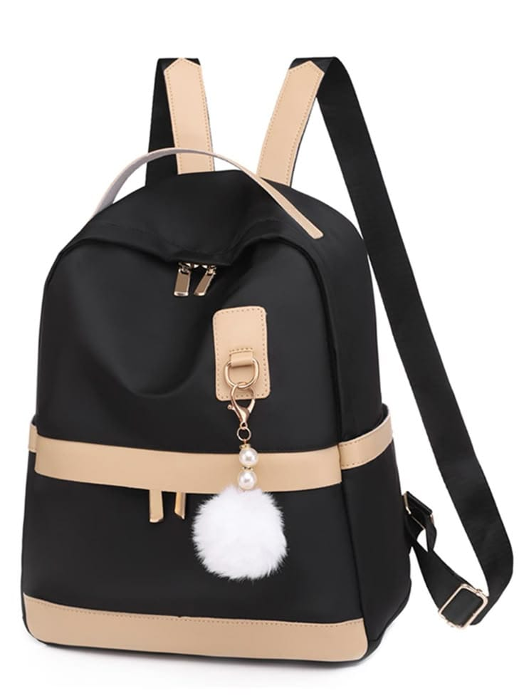
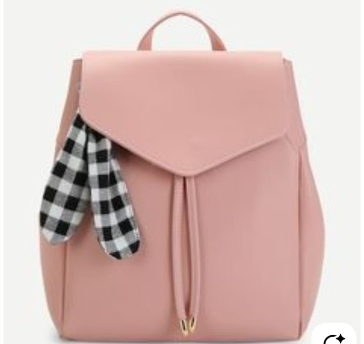
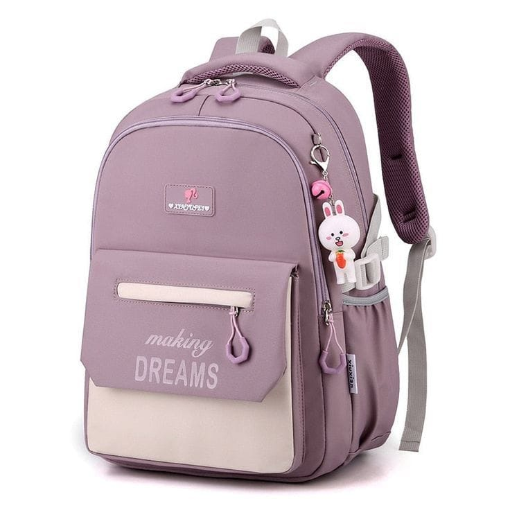
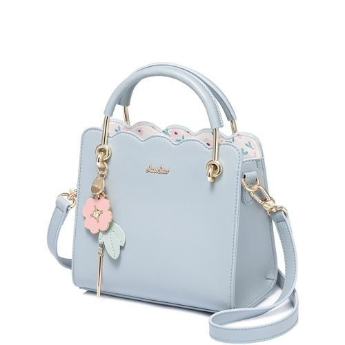

# Project Responsive Web Design using Bootstrap
## Date:16.10.2025

## AIM:
To create a simplified clone of Dribbble (https://dribbble.com/) landing page.


## DESIGN STEPS:

### Step 1:
Clone the repository from GitHub.

### Step 2:
Create Django Admin project.

### Step 3:
Create a New App under the Django Admin project.

### Step 4:
Insert the necessary CSS and JavaScript files as external in order to use Bootstrap.

### Step 5:
Create a HTML file and include the needed Bootstrap components.

### Step 6:
Publish the website in the LocalHost.

## PROGRAM :
```
dribble.css
<html lang="en">
<head>
  <meta charset="UTF-8">
  <title>Dribbble Style Page</title>
  <link href="https://cdn.jsdelivr.net/npm/bootstrap@5.3.2/dist/css/bootstrap.min.css" rel="stylesheet">
  <style>
    body {
      background-color: orange;
    }
    .subtext {
      color: grey;
    }
    .btn-learn {
      background-color: grey;
      color: white;
    }
    .btn-signup {
      background-color: pink;
      color: white;
    }
    .image-label {
      font-size: 1px;
      text-align: center;
      margin-top: 1px;
    }
    .navbar-brand {
      color: pink !important;
      font-weight: bold;
      font-size: 4px;
    }
  </style>
</head>
<body>
<!-- Dark Theme Navbar -->
  <nav class="navbar navbar-expand-lg navbar-dark bg-dark">
    <div class="container-fluid">
      <!-- Dribbble brand on left -->

dribble.html
<!-- Dark Theme Navbar -->
  <nav class="navbar navbar-expand-lg navbar-dark bg-dark">
    <div class="container-fluid">
      <!-- Dribbble brand on left -->
      <a class="navbar-brand" href="#">Dribbble</a>

      <!-- Navbar items -->
      <div class="collapse navbar-collapse">
        <ul class="navbar-nav ms-3"></ul>
      </div>
    </div>
  </nav>

  <!-- Top Bar for Sign In / Sign Up -->
  <div class="d-flex justify-content-end p-3 bg-white">
    <a href="#" class="me-3 text-decoration-none">Sign in</a>
    <a href="#" class="btn btn-signup">Sign up</a>
  </div>

 

  

 
 
 
 

 
 
 
 
 
 
      
  </div>

</body>
</html>
```


## OUTPUT:

.png>)

## RESULT:
The Project for responsive web design using Bootstrap is completed successfully.

## RESULT:
The Project for responsive web design using Bootstrap is completed successfully.
